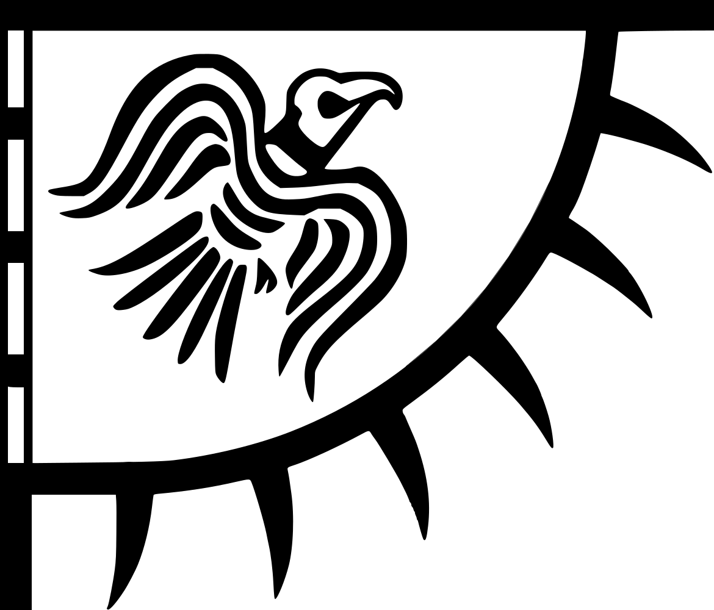
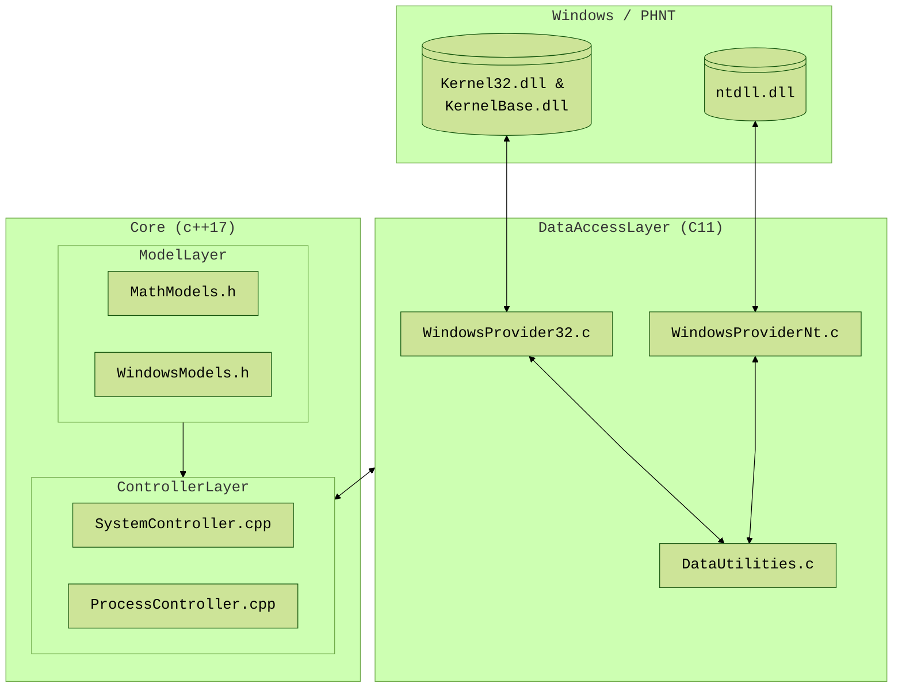

<table>
  <tr>
    <td>
        
    </td>
    <td>
      <h1>Muninn</h1>
      
      
      
      
      
    </td>
  </tr>
</table>

## Summary
Muninn is a Windows SDK (x86/x64) implemented in C11 and C++17.
It exposes a minimal, exceptionless, C11 API for a stable ABI,
enabling straightforward integration with languages such as C#, Rust, and Python.

The project emphasizes architectural clarity, deterministic behavior, explicity and support over convenience abstractions.

> **Disclaimer**: This SDK project is relatively new, the architecture is constantly evolving. Some commits may not compile at this time.

## Table of contents
- [Summary](#summary)
- [Table of contents](#table-of-contents)
- [Design characteristics](#design-characteristics)
- [Architecture](#architecture)
  - [DataAccessLayer](#dataaccesslayer)
  - [ModelLayer](#modellayer)
  - [ControllerLayer](#controllerlayer)
  - [ViewLayer](#viewlayer)
  - [Mermaid Diagram](#mermaid-diagram)
- [Documentation](#documentation)
- [Third-party Libraries](#third-party-libraries)
- [Build requirements](#build-requirements)
- [Contributors](#contributors)

## Design characteristics
- Exceptionless ISO C++17 & C11 written in Visual Studio
- Explicit resource ownership
- No hidden global state
- Minimal STL usage beyond containers and strings (C-style)
- Experimental structures are clearly marked `[[deprecated]]`, if any
- Verbose naming convention
- Visual C++ XML documentation integrated with Doxygen

## Architecture
Corvus follows a layered MVC-inspired structure:

Layers

  
### DataAccessLayer
C11 wrappers around Windows API's like:
- Win32
- Native NT (ntdll)

These functions:
- Avoid exceptions
- Prefer direct `NTSTATUS` returns

### ModelLayer
Pure, strongly-defined data structures that unify data acquisition across:
- ToolHelp32
- PSAPI
- Process Snapshot API
- Native NT structures

### ControllerLayer
Higher-level singleton controllers responsible for orchestrating model lifecycle, including initialization, population, and safe resource management.

Copy semantics are intentionally disabled to prevent unsafe resource duplication.

### ViewLayer
Contains raw user-interface-related utilities.
This layer is isolated from native process logic.

### Mermaid Diagram

## Documentation 
The project is documented using XML comments in Visual C++ within Visual Studio. The generated documentation is hosted online and accessible at: https://grimy86.github.io/Muninn/

## Third-party Libraries
Process Hacker Native Types:
  - [MIT License](https://github.com/winsiderss/phnt/blob/fc1f96ee976635f51faa89896d1d805eb0586350/LICENSE)  
  - [GitHub phnt repository](https://github.com/processhacker/phnt)

## Build requirements
C11 & C++17 require:
  - [Visual Studio](https://visualstudio.microsoft.com/)
  - [Desktop development with C++](https://learn.microsoft.com/en-us/cpp/build/vscpp-step-0-installation?view=msvc-170)

## Contributors
Thanks to these wonderful people for contributing:

